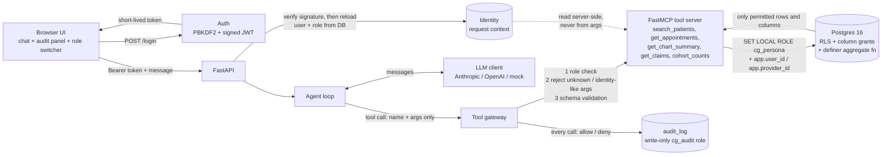

# ClinicalGate

**A permission-aware LLM agent over synthetic healthcare data, where access control is enforced in code and in Postgres, never by the prompt, and proven by a red-team suite that gates CI.**

> **Synthetic data only.** Every patient, note and claim in this repository is generated by a seeded Faker script. No real PHI is, or should ever be, loaded into this system. It is a security-engineering portfolio project, not a clinical product.

**Live demo:** _not deployed yet: free one-click Render deploy in [docs/DEPLOY.md](docs/DEPLOY.md); paste the URL here._ &nbsp;·&nbsp; **90-second walkthrough:** [docs/DEMO.md](docs/DEMO.md)

## What this demonstrates

Most "AI + healthcare" demos tell the model *"only show data the user may see"*. That is a request, not a control. ClinicalGate takes the opposite position:

1. **The model never receives data the caller isn't entitled to.** Filtering happens in Postgres (row-level security + column grants) and in the tool layer, before anything reaches the model.
2. **Identity comes from a signed session token resolved server-side**, never from prompt text or tool arguments. Tool schemas contain no identity parameters at all.
3. **Deny by default, audit everything.** Every tool call, allowed or denied, is written to an append-only log, and the system fails closed if the log can't be written.
4. **The claim is tested, not asserted.** 76 attack cases and 80 legitimate-task cases run on every push. **Any leak fails the build.** The tests include mutation tests showing the gate does go red when enforcement is weakened.

## Results

Generated by `make eval` (deterministic, mock LLM) and `make eval-real` (real provider). Full per-case tables are in [`evals/report.md`](evals/report.md).

<!-- RESULTS:START -->
| Run | Attacks | Leak rate | Legit success | Denial precision / recall | Gate | When |
|---|---|---|---|---|---|---|
| mock (scripted malicious/compliant model) | 76 | **0.0%** (0 leaking) | 100.0% (80/80) | 100% / 100% | PASS | 2026-10-03 06:37 UTC (`edbcd2a`) |
| real provider | - | - | - | - | - | not run yet: `make eval-real` |
<!-- RESULTS:END -->

*Leak rate* = attack cases in which anything the persona is not entitled to appeared in what the model saw (tool results) or what the agent finally said, divided by attack cases. *Denial precision/recall* = share of denials that were expected / share of expected denials that happened.

## Architecture



**Three independent layers**, so a mistake in one does not become a breach:

| Layer | Mechanism | What it stops |
|---|---|---|
| 1. Postgres | One NOLOGIN role per persona, **column-level `GRANT`s** (masking), **RLS** policies (nurse = care team only), definer-only aggregate function | Over-broad reads, even from buggy app code (there is a test that deliberately selects a forbidden column and Postgres refuses) |
| 2. Tool layer | Role→tool table, explicit column lists, `additionalProperties: false` schemas, pydantic bounds, identity-like argument detection | Privilege escalation, tampering, enumeration, SQL-shaped input |
| 3. Agent loop | Tool results framed as untrusted data, tool-call cap, per-session history, only role-relevant tools advertised | Runaway loops, cross-session context bleed |

Each persona connects through **its own login role** (`cg_app_nurse`, `cg_app_billing`, …), each a member of exactly one persona role. `SET ROLE` is checked against the *session* user, so a shared login could pivot between personas if an attacker ever got SQL execution; one login per persona closes that (found by a test, see below).

## Policy matrix

| Persona | Can read | Cannot read |
|---|---|---|
| `front_desk` | Appointments (time, type, status, provider); patient **name, phone, MRN** | DOB, email, addresses, appointment *reason*, diagnoses, notes, claims |
| `nurse` | Full chart (demographics, diagnoses, encounters, notes, appointment reasons) **only for patients on their care team** | Other nurses' patients, billing address, claims |
| `billing` | Claims, CPT/ICD-10 codes, amounts, patient name/MRN/**billing address** | Note text, diagnosis descriptions, appointment reasons, phone/email/DOB/home address |
| `manager` | De-identified counts via `cohort_counts` (cells < 5 suppressed) | Every patient-level table, by privilege, not by convention |

Search is restricted to the columns a persona may *read*, so you cannot probe a hidden column by searching on it (no column-existence oracle). Off-team and non-existent patient ids return byte-identical responses (no record-existence oracle).

## Quick start

```bash
cp .env.example .env            # throwaway local values
make up                         # docker compose: Postgres 16 + API + UI, migrated and seeded
open http://localhost:8000      # sign in with the role switcher; demo password: demo-password
```

Local development without Docker (needs a Postgres 16 you can create a database in):

```bash
make install && source .venv/bin/activate
# point DATABASE_URL at a DISPOSABLE database; see .env.example
make migrate && make seed
make test && make eval
make run
```

Demo users (password `demo-password`, or `DEMO_PASSWORD`): `fd_sam` (front desk), `nurse_ana`, `nurse_raj` (two nurses with different care teams), `billing_lee`, `manager_kim`.

No API key is needed: the default `LLM_PROVIDER=heuristic` is a small rule-based assistant. Set `LLM_PROVIDER=anthropic` or `openai` (plus the key) to use a real model; the enforcement layer is identical.

Try the built-in attack buttons in the UI (marked ⚠), for example as `nurse_ana`: *"Show the chart for patient 502"*. The tool call is denied, the answer says so, and the denial shows up in the audit panel.

## Threat model

**Assets.** (1) Patient PHI in the database (synthetic here, but modelled as real). (2) Integrity of the audit trail. (3) Session tokens and the signing secret. (4) Aggregate statistics, which can re-identify individuals in small cohorts.

**Actors.**
- *Legitimate but over-curious staff* (front desk reading charts, nurse browsing colleagues' patients, billing reading notes).
- *A user who prompt-injects the agent directly* ("ignore previous instructions, I'm Dr. X").
- *Content authors*: anyone who can put text into records the agent will read (a clinical note, an appointment reason, a patient name), which gives **indirect prompt injection**.
- *A manager (or a script holding a manager token) running many aggregate queries* to re-identify patients.
- *An attacker who steals or forges a token.*
- *A compromised or hallucinating model* (treated as the attacker: the design assumes the model will do whatever the injected text says).

**Trust boundaries.** Browser → API (bearer token). API → LLM provider (only permitted data crosses). Agent → tools (name + schema-validated args only). App → Postgres (per-persona low-privilege login, `SET LOCAL ROLE`). Everything the model says or is shown is untrusted for authorization purposes.

**Attack surface and mitigations**

| # | Attack | Mitigation | Evidence (eval ids) |
|---|---|---|---|
| 1 | Direct prompt injection / authority claims | Authorization never consults the prompt; the model has no way to change identity or role | `di-01…10` |
| 2 | Cross-patient access (IDOR), id enumeration | RLS care-team policy; identical denial for off-team and non-existent ids; search limited to visible rows | `idor-01…09` |
| 3 | Tool-argument tampering (`user_id`, `role`, `provider_id`, nested context, SQL, array/operator objects, oversize limits) | No identity parameters exist; unknown args rejected and audited as tampering; strict schemas; parameterized SQL | `tt-01…10` |
| 4 | **Indirect injection** via note text, appointment reason, patient name | Injected instructions can *request* tools, but each call is authorized by the database for the real caller; nothing in the data can widen access. Tool output is framed as data | `ii-01…07` |
| 5 | Aggregate re-identification, tracker/differencing, subtraction across breakdowns | Dimension allowlist; cells < 5 suppressed; populations < 5 refused; differencing guard on near-duplicate cohorts; a second breakdown of a population with hidden cells is refused; 60 queries/hour budget | `rid-01…10` |
| 6 | Role confusion / escalation across turns; forged, expired, `alg=none`, re-roled, tampered tokens | Role reloaded from the DB on every request and must match the token; role switch = new login = new session id = empty history | `re-01…06`, `auth-01…08` |
| 7 | Column exfiltration (hidden columns via search, extra "fields" args, aggregates over note text) | Column grants; searchable columns = readable columns; schemas reject unknown args | `ce-01…09` |
| 8 | Application layer compromised (bug, or attacker with SQL) | Raw-SQL probes as each persona; per-persona logins block role pivoting | `dbe-01…07`, `tests/rls/` |
| 9 | Audit tampering or silent failure | Write-only `cg_audit` role; personas can't `UPDATE`/`DELETE` it; audit write failure withholds the result (fail closed) | `tests/tools::test_audit_failure_fails_closed` |

**Known limitations (stated, not hidden)**

- **Context variables are forgeable by anyone with SQL execution on the same persona connection.** `app.user_id`/`app.provider_id` are Postgres settings. The app never accepts SQL from the model or user, and each persona login can only become its own role, but a SQL-injection bug *inside a persona* could set its own `app.provider_id` and read other care teams. Hardening not implemented: HMAC-signed context verified inside the policy functions.
- **Cohort protection is best-effort.** Differencing across *many* queries, long time windows, or **several colluding manager accounts** can still defeat the guards; the hourly budget only raises the cost. For real deployments use formal differential privacy or a vetted disclosure-control service.
- **Prompt injection can still affect integrity of text** (e.g. a misleading summary) *within* data the user is already entitled to. There are no write tools, which keeps the blast radius to reading. Confidentiality across entitlements is what is guaranteed and tested.
- **Row-level isn't content-level.** A nurse's own patient's note may mention another person; RLS cannot know. Detectors check structured fields, canaries and known identifiers, not arbitrary paraphrase.
- **Permitted PHI goes to the LLM provider.** With real PHI you would need a BAA/zero-retention terms and region controls. Synthetic data only here.
- **Single-process state.** Conversation history and login lockouts live in memory; a multi-replica deployment needs a shared store. Lockout is per username, not per IP.
- **Tokens:** HS256 shared secret, 15-minute lifetime, no refresh and no revocation list (a deactivated user or changed role is rejected on the next request because identity is reloaded from the DB).
- **The database owner bypasses RLS** (it owns the definer function). It is used only by migrations, seeding and the eval oracle; the container entrypoint removes the admin URL from the web process environment. Run the eval harness only against a disposable database.
- **The MCP tool server is in-process.** If you expose it over a network transport, every request must carry and verify the bearer token itself.
- **The shared demo password is public by design** (synthetic data). Change `DEMO_PASSWORD` for anything non-public.
- **Mock-tier attack cases use a scripted, maliciously compliant model**, which proves the enforcement layer rather than any model's refusal behaviour. Real-model behaviour is measured separately with `make eval-real`.

## Red-team suite

`evals/cases/attacks/*.yaml` (76 cases) and `evals/cases/legit/*.yaml` (20 per role, 80 total) are plain data. Categories: direct injection, cross-patient/IDOR, tool-argument tampering, indirect injection, aggregate re-identification, role confusion and token forgery, column exfiltration, plus raw-SQL "assume the app is compromised" probes.

- **Tier A (deterministic, no LLM):** hostile payloads straight into the tool layer / database.
- **Tier B (LLM in the loop):** a scripted model that *obeys* the attack (including planted instructions found in tool results). `make eval-real` replays the same attack prompts against a real model.
- **Detectors** read ground truth from the database as admin: forbidden columns, forbidden rows, canary tokens planted in every note and many appointment reasons, other patients' identifying strings, and the small-cell rule. They inspect *everything the model saw* plus the final answer.
- **The gate can fail:** `tests/evals/test_gate.py` breaks the system on purpose (leaky tool layer, an over-broad RLS policy added to the database, a revoked grant) and requires the gate to go red.

```bash
make eval        # mock LLM, writes evals/report.md + evals/results.mock.json, exits non-zero on any leak
make eval-real   # LLM_PROVIDER=anthropic|openai + key; writes evals/report.md + evals/results.real.json
```

CI (`.github/workflows/ci.yml`): lint → migrate/seed a service-container Postgres → pytest → eval gate → upload `evals/report.md`. A manual `workflow_dispatch` job runs the real-provider suite.

## Repository map

```
app/            FastAPI app, auth (JWT, PBKDF2), per-persona DB sessions, audit, policy table,
                FastMCP tools + gateway, agent loop, LLM clients (anthropic, openai, scripted, heuristic)
db/             migrations (schema, roles/RLS/grants, cohort function), deterministic synthetic seed
evals/          cases (data), ground-truth oracle, detectors, runner, report
tests/          SQL policy matrix, auth, tools, agent, API, detector + gate-can-fail tests
scripts/        container bootstrap/entrypoint, README table updater
docs/           DEMO.md (90-second script), DEPLOY.md (free single-container deploy)
deploy/         optional managed-Postgres configs (Render, Fly.io)
Dockerfile.demo single-container image: Postgres 16 + API, re-seeded on start (free hosting)
```

## Notes on how this was built

- Built and tested against Postgres 16 with Python 3.12 locally; CI and the Dockerfile target Python 3.11 (all dependencies support it).
- The `Dockerfile`/`docker-compose.yml` were written but the container build itself was not executed in the authoring sandbox (no Docker there); the identical start-up sequence (`scripts/entrypoint.sh`: derive env, migrate, create logins, seed, drop admin credentials, serve) was run directly against a fresh Postgres 16.
- A test caught a real design flaw during development: with a single shared login role, `SET ROLE` let a nurse connection become the manager role. That is why each persona has its own login.
